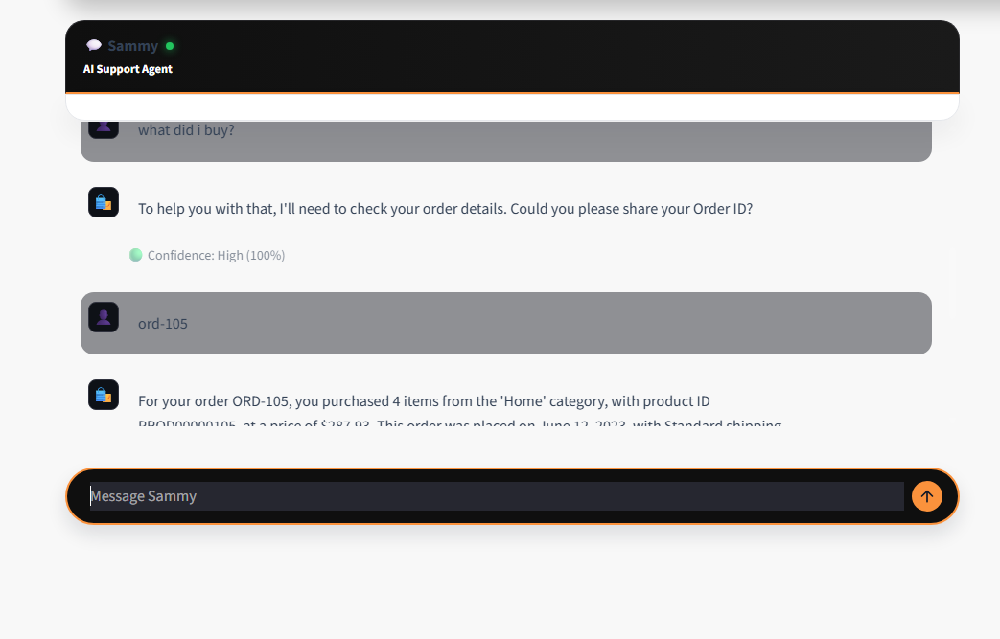
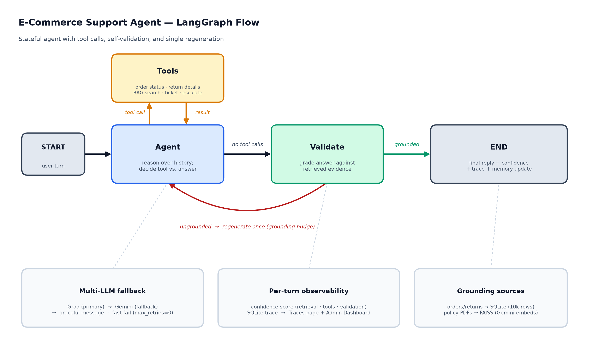
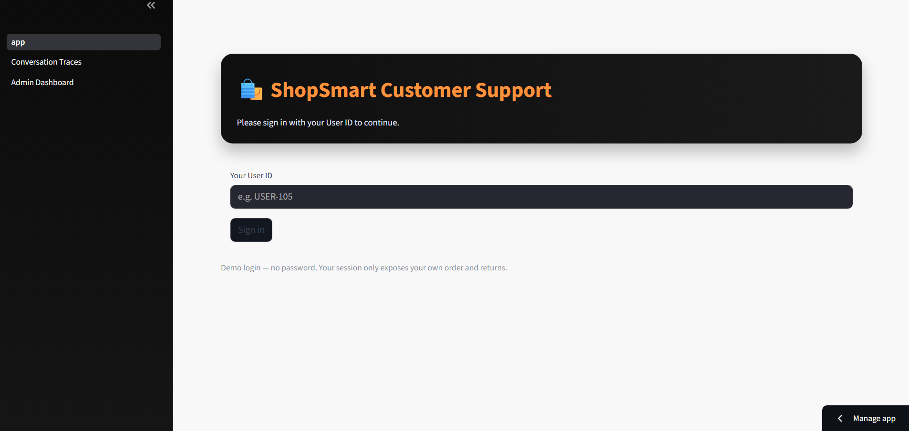
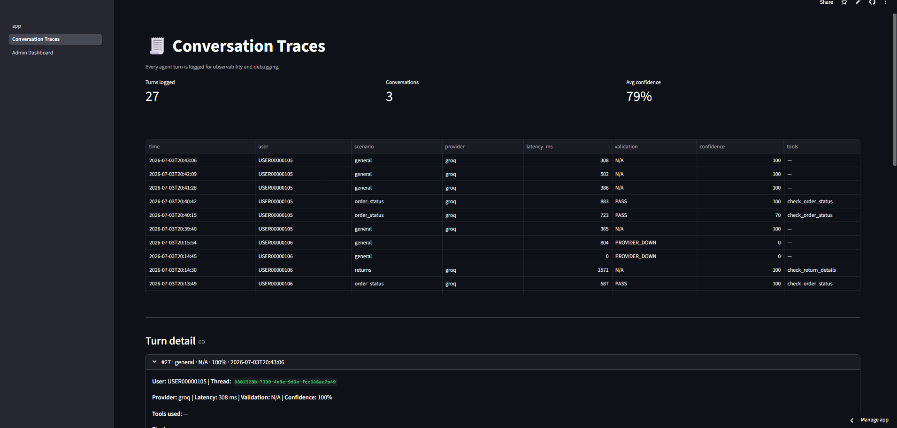
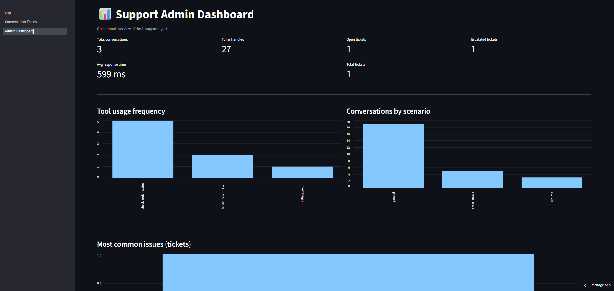

# 🛍️ E-Commerce Customer Support Agent

> A grounded, tool-calling AI support agent with per-user data scoping, response validation, and built-in observability.

An AI customer-support assistant for e-commerce, built with **LangGraph**, **LangChain**, **RAG (FAISS)**, and **Streamlit**. A signed-in customer can ask about **their own** orders and returns; the agent looks up real data through tools, answers questions about shipping/returns/FAQ from policy documents via RAG, and **validates its own answers against the evidence** before replying — with an explainable confidence score, per-conversation tracing, and an admin dashboard.

**Built by:** Akshay Kumar
**GitHub:** [Akshay-professor](https://github.com/Akshay-professor) · **LinkedIn:** [akshay-poddar](https://www.linkedin.com/in/akshay-poddar-4299a5243/)

---



---

## 🎯 What This Is

Most support-chatbot demos happily invent order IDs and refund details. This project is built around **not doing that**:

- A signed-in customer sees **only their own** order and return data. Looking up someone else's order is refused — *without revealing whether that order exists*.
- Every answer is **graded against the tool/document evidence** that produced it; if it isn't grounded, the agent regenerates once before replying.
- Each turn shows a **confidence score**, and every turn is **logged to a traces page** and rolled up into an **admin dashboard**.

---

## ✨ Key Features

- **Per-user login with data scoping** — type a User ID to sign in; the agent can only access that customer's orders/returns. Cross-account lookups return the same "not found on your account" response as a non-existent order, so existence is never leaked. *(Simulated login — no password; see Limitations.)*
- **Response validation node** — an LLM grader checks each answer against the retrieved evidence; ungrounded answers trigger a single regeneration with a grounding nudge.
- **Explainable confidence score** — a weighted blend of retrieval quality, tool success, and validation outcome, shown per response (🟢 / 🟡 / 🔴).
- **Conversation tracing** — every turn (provider, latency, tools used, retrieved docs, validation result, confidence) is written to SQLite and viewable on a dedicated Traces page.
- **Admin dashboard** — aggregate metrics across conversations (volume, confidence distribution, validation outcomes, provider usage).
- **Enhanced memory** — a per-customer profile, rolling conversation summaries, and lightweight preferences persist across threads and are injected into future turns.
- **Multi-LLM fallback** — Groq (primary) → Gemini (fallback) with fast-fail, so a provider outage degrades gracefully instead of crashing. Auxiliary calls (grader, summarizer) are pinned to Groq to reserve Gemini's daily quota for real answers.
- **Tool-calling agent** — the LLM decides which tool to call (order lookup, return details, RAG search, ticket, escalation) rather than hardcoded if/else routing.

---

## 🧠 Architecture

A stateful **LangGraph** directed graph manages reasoning, tool execution, and validation:

```
              ┌─────────────────────────────────────────────┐
              │                                             ▼
User turn ─▶ [Agent] ──has tool calls?──▶ [Tools] ──▶ (back to Agent)
              │                                    (order/return/RAG/ticket/escalate)
              │ no tool calls
              ▼
          [Validate] ──ungrounded & retries left?──▶ (back to Agent, regenerate once)
              │
              │ settled (PASS / N/A / FAIL)
              ▼
        Final reply  +  confidence score  +  trace logged  +  memory updated
```

**Multi-LLM fallback:** `Groq (primary) → Gemini (fallback) → graceful message`. Model construction uses `max_retries=0` + a short timeout so a rate-limited provider fails over instantly instead of stacking backoff retries.



---

## 🔍 RAG Pipeline

Policy documents are chunked, embedded, and stored in FAISS — one index per category (returns / shipping / general).

```
PDF documents (returns / shipping / general)
    ↓  RecursiveCharacterTextSplitter (chunk_size=500, overlap=50)
    ↓  Google Generative AI embeddings (gemini-embedding-001)
    ↓  FAISS vector store (saved locally per category)
    ↓  Retriever (top-k=3 semantic search, returns a quality score)
    ↓  Agent tool → LLM synthesizes a grounded answer
```

The retriever also returns a normalized similarity score, which feeds the confidence calculation.

---

## 🗄️ Order & Returns Data

Order lookups run against a local SQLite table seeded (once, lazily) from a **10,000-row synthetic e-commerce returns dataset** (`storage/data/ecommerce_returns.csv`). Each row is one customer with one order:

- `Order_ID` → `ORD00000001`…`ORD00000010000`, aligned 1:1 with `User_ID` (`USER00000001`…).
- Real fields: product category, price, order date, return status/reason/date, days-to-return, payment/shipping method, and customer demographics.
- **Shipping status is derived deterministically** (the dataset has no live tracking field): returned orders → *"Returned - Refund Processed"*; otherwise a stable status (*Delivered / In Transit / Processing*) is assigned from the order ID so it never changes between runs.

Log in with any valid ID — friendly formats are normalized (`USER-105`, `user 105`, `105` → `USER00000105`; same for `ORD-105`).

---

## 🛠️ Tech Stack

| Layer | Tool |
|---|---|
| Orchestration | LangGraph + LangChain |
| Primary LLM | Groq API — Llama 3.1 (configurable via `GROQ_MODEL`) |
| Fallback LLM | Google Gemini — `gemini-2.5-flash` (configurable via `GEMINI_MODEL`) |
| RAG / Vector store | FAISS + Google `gemini-embedding-001` |
| Conversation checkpoints | SQLite via LangGraph `SqliteSaver` |
| Orders / traces / tickets / memory | SQLite |
| Frontend | Streamlit (multipage) |
| Config | python-dotenv / Streamlit secrets |

---

## 📐 Agent Tools

| Tool | Purpose |
|---|---|
| `check_order_status` | Looks up the **signed-in user's** order by ID (scoped; refuses others') |
| `check_return_details` | Returns status/reason/date/days-to-return for the user's own order |
| `initiate_return` | Starts a return with reason logging |
| `create_support_ticket` | Persists an unresolved issue with a ticket ID |
| `escalate_to_human` | Logs an escalation ticket (stub — no live routing queue) |
| `search_return_policy` | RAG over return/refund policy docs |
| `search_shipping_policy` | RAG over shipping/delivery policy docs |
| `search_general_faq` | RAG over general/FAQ docs |

---

## 📂 Project Structure

```
eCommerce-Customer-Support-Agent/
├── app.py                       # Streamlit UI, login gate, streaming, confidence badge
├── main.py                      # LangGraph graph: agent → tools/validate, fallback, grader, memory
├── tools.py                     # 8 tools (scoped order/return lookups + RAG + ticket/escalation)
├── prompt.py                    # System prompt, grader prompt, regen nudge, summary prompt
├── requirements.txt
│
├── pages/
│   ├── 1_Conversation_Traces.py # Per-turn trace inspection
│   └── 2_Admin_Dashboard.py     # Aggregate metrics
│
├── rag/
│   ├── retriever.py             # FAISS build/load + scored retrieval (Google embeddings)
│   ├── vectorstores/            # Saved FAISS indexes (per category)
│   └── docs/{returns,shipping,general}/   # Policy PDFs
│
└── storage/
    ├── orders_store.py          # 10k-row dataset → SQLite; ID normalization + scoped lookups
    ├── trace_store.py           # conversation_traces table + dashboard metrics
    ├── ticket_store.py          # tickets table
    ├── memory_store.py          # profiles, summaries, preferences
    ├── turn_context.py          # per-turn observability side-channel (keyed by thread_id)
    └── data/ecommerce_returns.csv   # 10,000-row synthetic returns dataset (seed)
```

---

## ▶️ Run Locally

**1. Clone**
```bash
git clone https://github.com/Akshay-professor/E-Commerce-Customer-Support-Agent.git
cd E-Commerce-Customer-Support-Agent
```

**2. Install** (Python 3.12 recommended)
```bash
pip install -r requirements.txt
```

**3. Configure `.env`**
```env
GROQ_API_KEY=your_groq_key
GROQ_MODEL=llama-3.1-8b-instant

GEMINI_API_KEY=your_gemini_key
GEMINI_MODEL=gemini-2.5-flash

LLM_PROVIDER=groq
```
Get a free Groq key at [console.groq.com](https://console.groq.com) · Gemini key at [aistudio.google.com](https://aistudio.google.com). Both are also used for embeddings (Gemini) and RAG.

**4. Build RAG vector stores (first run only)**
```bash
python rag/retriever.py
```

**5. Run**
```bash
streamlit run app.py
```
Sign in with a User ID like `USER-105`, then try: *"where is my order?"*, *"was my order returned and why?"*, or ask about return/shipping policy.

---

## ☁️ Deploy on Streamlit Cloud

1. Push to GitHub, then [share.streamlit.io](https://share.streamlit.io) → **New app** → select repo, main file `app.py`.
2. Set the Python version to **3.12** (Advanced settings).
3. Add **Secrets**:
   ```toml
   GROQ_API_KEY = "your_groq_key"
   GROQ_MODEL = "llama-3.1-8b-instant"
   GEMINI_API_KEY = "your_gemini_key"
   GEMINI_MODEL = "gemini-2.5-flash"
   LLM_PROVIDER = "groq"
   ```
4. **Deploy.**

---

## 📸 Screenshots

| | |
|---|---|
| **Login gate** — typed User-ID sign-in |  |
| **Chat + confidence** — scoped order/return answers |  |
| **Conversation Traces** — per-turn observability |  |
| **Admin Dashboard** — aggregate metrics |  |

---

## ⚠️ Limitations

- **Simulated login** — a valid User ID signs you in; there is no password/auth. Fine for a demo; production would need real authentication.
- **Synthetic dataset** — orders come from a generated 10k-row CSV seeded into SQLite, not a live order system. Some rows have quirky values inherent to synthetic data.
- **Free-tier quotas** — on free Groq/Gemini keys, rapid-fire messages can momentarily hit rate limits; the app degrades gracefully (neutral confidence, skipped summary) rather than crashing.
- **Escalation is a stub** — it logs a ticket but does not notify a real agent or routing queue.
- **Validation is LLM-based** — the grounding grader is itself an LLM call and not infallible; it reduces, not eliminates, hallucination.

---

## 📄 License

Owned and maintained by **Akshay Kumar**. Fork and build on it with attribution.
